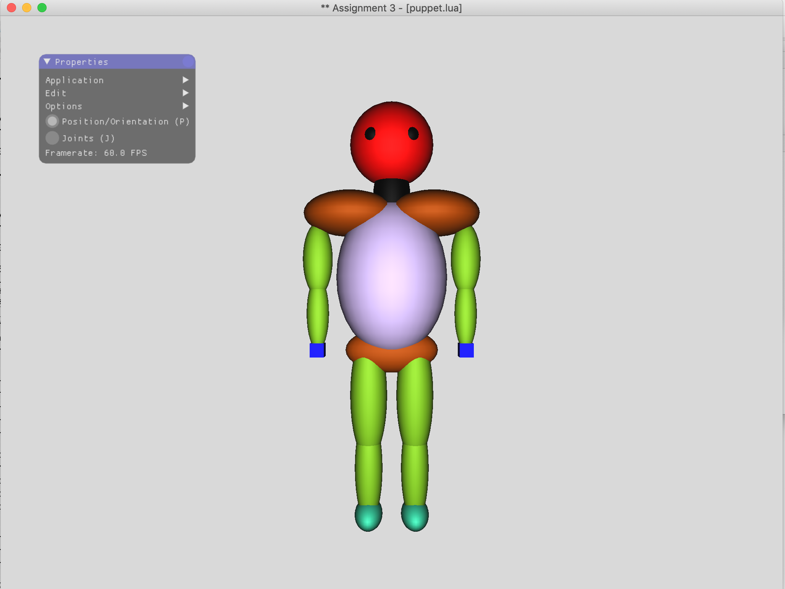

# Puppet

---

## Purposes
Constructed a hierarchical 3D model in Lua, and then rendered the final puppet in OpenGL

## Guid to use

* press I to set the origin of the puppet to its initial state 
* press O to set the puppet to its initial orientation
* press R to reset all joint angles
* press Q to quit

## Interface

